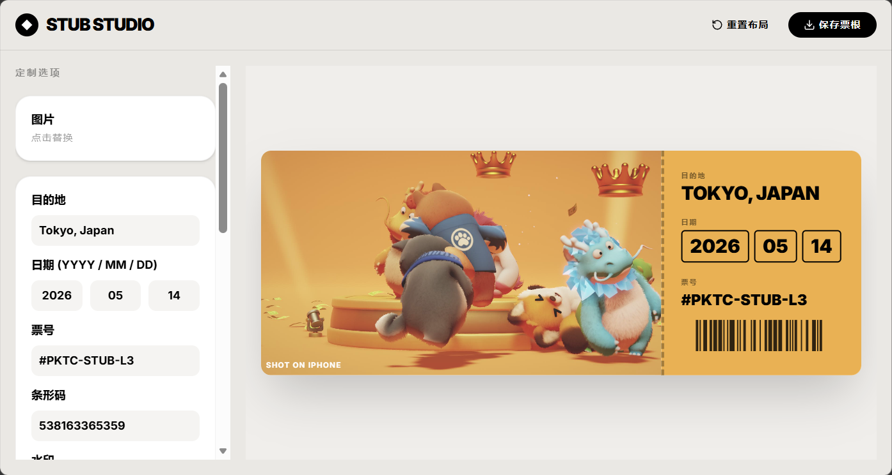

# 🎟️ Stub Studio (票根工作室)

一个优雅、极简的在线票根生成工具。通过上传照片并进行简单的文本和排版定制，快速生成具有设计感的纪念票根。

 
 

## ✨ 特性 (Features)

* **📸 灵活的图片处理**: 支持图片拖拽上传，提供覆盖 (Cover)、包含 (Contain) 模式，并可自由调整图片比例和缩放。
* **✍️ 丰富的文本定制**: 自定义目的地、日期、票号、条形码及背景水印。
* **🎨 智能色彩提取**: 自动提取上传图片的主题色作为票根背景，也可自定义背景显示和尺寸。
* **🖱️ 自由拖拽排版**: 票根上的所有文本元素均支持自由拖拽，实现精确的所见即所得 (WYSIWYG) 排版。
* **📱 移动端友好**: 针对手机端横屏模式进行了深度空间优化，在移动设备上也能获得完美的编辑体验。
* **💾 高清导出**: 一键将设计好的票根导出为高质量的 PNG 图片。

## 🛠️ 技术栈 (Tech Stack)

* **前端框架**: [React 18](https://react.dev/) + [TypeScript](https://www.typescriptlang.org/) + [Vite](https://vitejs.dev/)
* **样式**: [Tailwind CSS](https://tailwindcss.com/)
* **交互与动画**: [Framer Motion](https://www.framer.com/motion/) (用于物理拖拽和丝滑动画)
* **功能组件**: 
  * `react-dropzone` (拖拽上传文件)
  * `html-to-image` (将 DOM 节点转换为高质量图片导出)
* **图标库**: [Lucide React](https://lucide.dev/)

## 🚀 快速开始 (Getting Started)

### 1. 克隆仓库
```bash
git clone <your-github-repo-url>
cd stub-studio
```

### 2. 安装依赖
```bash
npm install
```

### 3. 启动开发环境
```bash
npm run dev
```
打开浏览器并访问控制台提示的本地地址（如 `http://localhost:3000`）。

### 4. 构建生产版本
```bash
npm run build
```

## 💡 使用指南

**Stub Studio** 的设计理念是“所见即所得”，您可以通过左侧的控制面板实时调整票根的每一个细节：

### 1. 🖼️ 照片导入与处理
* **上传**: 点击左侧控制面板顶部的图片区域，或直接将图片拖拽至该区域即可上传。
* **图片比例 (Image Aspect Ratio)**: 通过滑块调整照片的长宽比。
* **图片缩放 (Image Zoom)**: 使用滑块放大局部细节。
* **图片填充模式 (Cover/Contain)**: 切换模式决定图片是充满区域 (Cover) 还是完整显示全部内容 (Contain)。

### 2. ✍️ 文本内容定制
在控制面板中输入您想要记录的信息，这些内容会实时同步到右侧的票根预览区：
* **目的地**: 记录旅行地或事件名称。支持在面板下方独立调整 **目的地字体大小**。
* **日期**: 分别输入年 (YYYY)、月 (MM)、日 (DD)。
* **票号 & 条形码**: 打造专属的个性化编码。
* **水印**: 票根边缘的暗纹文本，增加真实感。

### 3. 🖱️ 自由拖拽与排版 (核心功能)
* **基础布局**: 一键切换票根的 **横向 (Horizontal)** 或 **竖向 (Vertical)** 整体结构。
* **自由拖拽**: 票根上的 **“目的地”、“日期”、“票号”** 文本块均支持自由拖拽！将鼠标悬浮在这些文本上，直接拖动它们到画布的任何位置，完成绝对个性化的排版。
* **重置布局**: 如果排版乱了，随时点击顶部导航栏的 **“重置布局”** 按钮将其归位。

### 4. 🎨 背景与色彩魔法
* **智能提取背景**: 上传图片后，系统会自动提取图片的主题色（Dominant Color）作为画布底色。你也可以点击颜色块手动修改。
* **画框模式**: 勾选 **“显示背景”** 后，票根周围会留出边距，形成类似画框的高级感。你可以自由调整背景的 **宽度** 和 **高度**。

### 5. 💾 高清导出
* 调整完毕后，点击右上角的 **“保存票根”**，系统会自动将当前预览区的内容截取并生成一张高清的 PNG 纪念图片，保存到您的设备中。

### 📱 移动端小贴士
* 如果您使用手机访问，为了保证拖拽和预览的完美体验，请 **解除手机的方向锁定，并将手机横向握持**，系统会自动为您适配最佳的宽屏操作界面！

## 📄 开源协议 (License)

本项目基于 [MIT License](LICENSE) 开源。您可以自由地使用、修改和分发。
